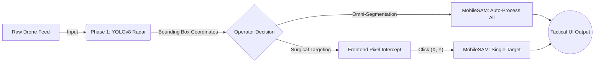

<div align="center">

# 🛰️ SENTINEL-AI 
### Zero-Shot Aerial Reconnaissance & Neural Target Extraction

<p align="center">
  <a href="#overview">Overview</a> •
  <a href="#core-architecture">Architecture</a> •
  <a href="#tactical-features">Features</a> •
  <a href="#installation-protocols">Installation</a> •
  <a href="#live-deployment">Live Demo</a>
</p>

[](https://python.org)
[](https://pytorch.org/)
[](https://github.com/ultralytics/ultralytics)
[](https://streamlit.io/)
[](https://huggingface.co/)

<a href="https://huggingface.co/spaces/uttam250/Sentinel-AI"></a>
</div>

---

## 📖 Overview

**Sentinel-AI** is a next-generation intelligence dashboard. It bridges the gap between state-of-the-art bounding-box object detection and advanced foundation models. By piping the telemetry of a custom-trained **YOLOv8** radar directly into the **Mobile Segment Anything Model (MobileSAM)**, Sentinel-AI provides operators with unparalleled, zero-shot pixel-isolation capabilities.

This is not a static script. It is a highly interactive, full-stack "Tactical OS" where users can upload raw satellite/drone telemetry and dynamically interact with neural networks in real-time via the frontend interface.

---

## 🧠 Core Architecture

The system operates on a dual-engine neural pipeline:



---

## ⚡ Tactical Features

### 1. Precision Radar (Target Acquisition)
At the core of the system is a **YOLOv8** model custom-trained on the `VisDrone` dataset. It is strictly calibrated to lock onto 10 specific aerial signatures from a top-down perspective, filtering out all background noise:
> *Pedestrian, People, Bicycle, Car, Van, Truck, Tricycle, Awning-Tricycle, Bus, and Motor.*

### 2. Omni-Segmentation Protocol
When activated, the AI operates in an "overwatch" capacity. It intercepts every single bounding box detected by YOLO's radar and feeds the spatial coordinates dynamically into the SAM foundation model—perfectly masking all targets in the frame simultaneously.

### 3. Surgical Targeting Mode (Zero-Shot UI)
This system captures live interactions directly from the operator's mouse. 
- The background inference pauses. 
- The operator visually scans the raw drone feed and clicks on a specific anomaly (e.g., a single vehicle). 
- The frontend intercepts the exact `[X, Y]` pixel coordinates and passes them as a point-prompt payload to PyTorch.
- The foundation model surgically extracts only that specific object in milliseconds.

### 4. Interactive Telemetry (Plotly)
Static images are replaced with a high-performance **Plotly** mapping engine. Operators can utilize Google-Maps style infinite zoom and pan capabilities over the high-resolution drone imagery to inspect coordinate layouts and mask boundaries closely.

---

## 💻 Installation Protocols

To initialize Sentinel-AI on your local machine, execute the following commands in your terminal:

### 1. Clone the Repository
```bash
git clone https://github.com/uttam1008/Sentinel-AI.git
cd Sentinel-AI
```

### 2. Establish Virtual Environment & Dependencies
```bash
python -m venv venv
source venv/bin/activate  # On Windows use: venv\Scripts\activate
pip install -r requirements.txt
```
> *Note: OpenCV requires underlying system graphics libraries. If you are on Linux, ensure `libgl1-mesa-glx` is installed.*

### 3. Boot the Tactical OS
```bash
python -m streamlit run streamlit_app.py
```

---

## ☁️ Live Deployment

Sentinel-AI has been packaged and deployed to a live cloud server via Hugging Face Spaces. The environment operates on a dedicated Linux container, allowing you to run the heavy foundation models directly from your browser or mobile device.

<div align="center">
  
### [🚀 LAUNCH SENTINEL-AI DASHBOARD](https://huggingface.co/spaces/uttam250/Sentinel-AI)

</div>

---

<div align="center">
  <p><i>Engineered by <b>Uttam Parmar</b>. For research, portfolio demonstration, and computer vision advancement.</i></p>
</div>
