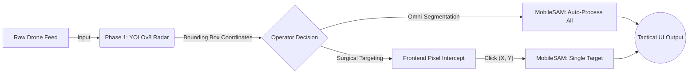

# 🛰️ SENTINEL-AI 
### Zero-Shot Aerial Reconnaissance & Neural Target Extraction

  <a href="#overview">Overview</a> •
  <a href="#core-architecture">Architecture</a> •
  <a href="#tactical-features">Features</a> •
  <a href="#global-access-cloud-inference-engine">Live Demo</a>

---

## 📖 Overview

**Sentinel-AI** is a next-generation intelligence dashboard. It bridges the gap between state-of-the-art bounding-box object detection and advanced foundation models. By piping the telemetry of a custom-trained **YOLOv8** radar directly into the **Mobile Segment Anything Model (MobileSAM)**, Sentinel-AI provides operators with unparalleled, zero-shot pixel-isolation capabilities.

This is not a static script. It is a highly interactive, full-stack "Tactical OS" where users can upload raw satellite/drone telemetry and dynamically interact with neural networks in real-time via the frontend interface.

---

## 🧠 Core Architecture

The system operates on a dual-engine neural pipeline:

---

## 🔬 Scientific Research: Architectural Scaling & Feature Retention

Sentinel-AI serves as an active research environment to study the effects of foundation model scaling on ultra-high density, micro-target aerial imagery (VisDrone2019-DET).

### Baseline Benchmarking: YOLOv8n vs YOLOv8s
| Metric | YOLOv8n (Nano) | YOLOv8s (Small) | Delta |
| :--- | :--- | :--- | :--- |
| **Parameter Count** | 3.2 Million | 11.2 Million | **+350% Capacity** |
| **Mean Average Precision (mAP50)** | 32.5% | 38.8% | **+19.4% Boost** |
| **Micro-Target Extraction** | Feature Collapse | High Retention | **Critical Shift** |

### Key Discoveries
1. **Convolutional Channel Depth Overcomes the "Resolution Floor"**
   Deep bounding-box metric analysis revealed that **85.9% of all targets in VisDrone are <32x32 pixels** (Micro-Targets). In dense testing (e.g., parking lots), the shallow channel depth of the Nano architecture mathematically erased weak pixel signatures, resulting in complete feature collapse for pedestrians. By scaling to the Small architecture, the network retained these microscopic gradients deeper into the convolution layers, successfully extracting anomalous human targets the baseline model missed entirely.
   
2. **Class Discrepancy via Aerial Geometry**
   We proved that Average Precision (AP) is heavily dictated by cross-sectional pixel footprints. Vehicles achieve up to **79.0% AP50** due to their large top-down rectangular geometry. Conversely, Bicycles collapse to **13.0% AP50** because their physical width from a 90-degree aerial perspective is virtually invisible at standard sensor resolutions.

---

## ⚡ Tactical Features

### 1. Precision Radar (Target Acquisition)
At the core of the system is a **YOLOv8** model custom-trained on the `VisDrone` dataset. It is strictly calibrated to lock onto 10 specific aerial signatures from a top-down perspective, filtering out all background noise:
> *Pedestrian, People, Bicycle, Car, Van, Truck, Tricycle, Awning-Tricycle, Bus, and Motor.*

### 2. Omni-Segmentation Protocol
When activated, the AI operates in an "overwatch" capacity. It intercepts every single bounding box detected by YOLO's radar and feeds the spatial coordinates dynamically into the SAM foundation model—perfectly masking all targets in the frame simultaneously.

### 3. Surgical Targeting Mode (Zero-Shot UI)
This system captures live interactions directly from the operator's mouse. 
- The background inference pauses. 
- The operator visually scans the raw drone feed and clicks on a specific anomaly (e.g., a single vehicle). 
- The frontend intercepts the exact `[X, Y]` pixel coordinates and passes them as a point-prompt payload to PyTorch.
- The foundation model surgically extracts only that specific object in milliseconds.

### 4. Interactive Telemetry (Plotly)
Static images are replaced with a high-performance **Plotly** mapping engine. Operators can utilize Google-Maps style infinite zoom and pan capabilities over the high-resolution drone imagery to inspect coordinate layouts and mask boundaries closely.

---

## 🌍 Global Access: Cloud Inference Engine

Sentinel-AI is decoupled from local hardware constraints. The entire neural pipeline has been containerized and deployed to a high-performance **Hugging Face** cloud infrastructure. 

This allows external researchers, reviewers, and recruiters to execute complex foundation models (YOLOv8s + MobileSAM) dynamically from any web browser, with zero local installation required.

 

  
  
<i>Secure connection established. Click to launch the web-dashboard.</i>

---

  
<i>Engineered by <b>Uttam Parmar</b>. For research, portfolio demonstration, and computer vision advancement.</i>

